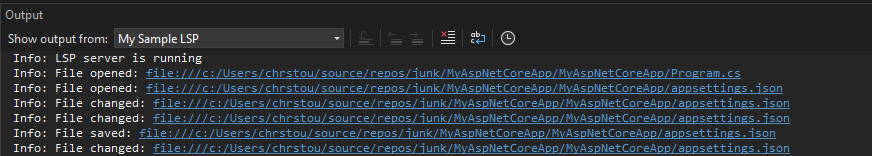

# VsDocumentTypeEventsExt

This is an example Visual Studio 2022 extension that integrates with an LSP language server.

The Language Server writes messages to the Output panel when it receives textDocument open/changed/saved/closed LSP protocol messages. The intention is to see when Visual Studio sends file related messages over LSP, and for which files.



# Problems

## JSON Support

Visual Studio's LSP extensibility does not appear to support JSON files out of the box.

When the language client is declared with the default `code` content type:

```csharp
[Export(typeof(ILanguageClient))]
[ContentType("code")]
public class LspClient : ILanguageClient
```

The output pane shows messages when you interact with .cs files, but not .json files.

If you try to add a declaration for JSON files:

```csharp
[Export(typeof(ILanguageClient))]
[ContentType("JSON")] // This isn't enough to make VS send doc messages for JSON files
[ContentType("code")]
public class LspClient : ILanguageClient
```

The output pane shows that textDocument messages are not being sent to the language server.

The only approach I could find that works is to define a custom [content type](./VsDocumentTypeEventsExt/Lsp/JsonContentType.cs), which must declare a `BaseDefinition` of JSON. This content type is then registered with the language client:

```csharp
[Export(typeof(ILanguageClient))]
[ContentType(JsonContentType.ContentTypeName)] // This is required to get textDoc messages for JSON files
[ContentType("code")]
public class LspClient : ILanguageClient
```

With this adjustment, text document messages are sent over LSP when JSON files are modified.

This approach doesn't seem ideal, as it overrides .json files to be this custom content type.

# Try it out

- load the solution in Visual Studio
- build the `LspServer` project
- Edit `LspClient.ActivateAsync` to update the `ProcessStartInfo` path to your build location for `LspServer`
- Compile the solution
- set `VsDocumentTypeEventsExt` as your startup project
- Press F5 (start debugging)
- In the experimental instance of Visual Studio:
  - Open, modify, save, and close various files. As you do, notice the messages written to the `My Sample LSP` Output pane
